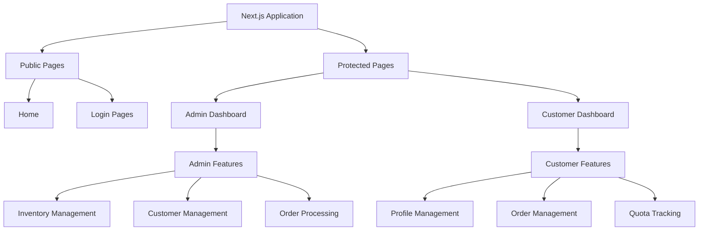
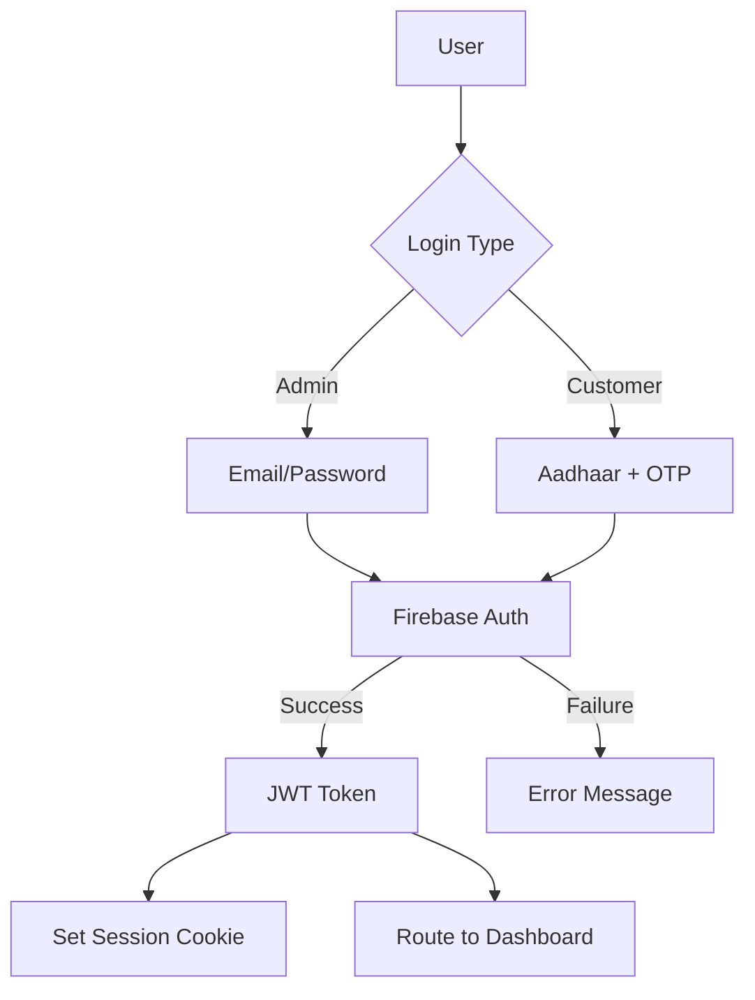
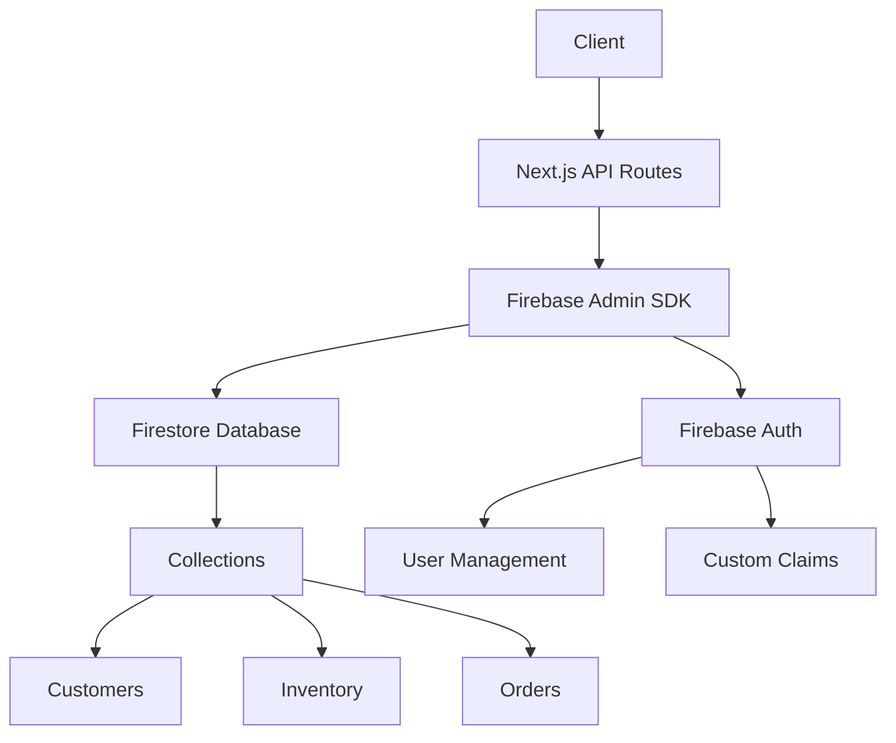

# Ration Shop Management System - Architecture Documentation

## System Overview

The Ration Shop Management System is a web-based application designed to modernize and streamline the operations of government ration shops. It provides a dual-interface system:
- A secure admin portal for ration shop management
- A user-friendly customer interface for ration card holders

## Core Features

### Admin Portal
1. **Inventory Management**
   - Track stock levels of essential commodities (rice, wheat, sugar, kerosene)
   - Set prices based on ration card categories
   - Monitor minimum stock levels
   - Real-time stock updates

2. **Customer Management**
   - Register new ration card holders
   - Manage family member details
   - Track monthly quota allocations
   - Verify Aadhaar linkage

3. **Order Processing**
   - View and process customer orders
   - Track order history
   - Manage order status
   - Generate reports

### Customer Portal
1. **Account Management**
   - Aadhaar-based authentication
   - View ration card details
   - Check monthly quotas
   - Update profile information

2. **Shopping Features**
   - View available items and prices
   - Check stock availability
   - Place orders
   - Track order status

## System Architecture

### 1. Frontend Architecture



### 2. Authentication Flow



### 3. Data Flow Architecture



## Database Design

### 1. Collections Structure

#### Customers Collection
```typescript
interface Customer {
    id: string;
    aadhaarNumber: string;
    name: string;
    phone: string;
    address: string;
    rationCardType: 'WHITE' | 'YELLOW' | 'GREEN' | 'SAFFRON' | 'RED';
    rationCardNumber: string;
    familyMembers: Array<{
        name: string;
        aadhaarNumber: string;
        relationship: string;
        age: number;
    }>;
    monthlyQuota: {
        rice: number;
        wheat: number;
        sugar: number;
        kerosene: number;
    };
}
```

#### Inventory Collection
```typescript
interface InventoryItem {
    id: string;
    name: string;
    quantity: number;
    unit: string;
    minimumStock: number;
    prices: {
        WHITE: number;
        YELLOW: number;
        GREEN: number;
        SAFFRON: number;
        RED: number;
    };
    lastUpdated: Timestamp;
}
```

#### Orders Collection
```typescript
interface Order {
    id: string;
    customerId: string;
    items: Array<{
        itemId: string;
        quantity: number;
        priceAtTime: number;
    }>;
    totalAmount: number;
    status: 'pending' | 'completed' | 'cancelled';
    orderDate: Timestamp;
    rationCardType: RationCardType;
}
```

## Security Implementation

### 1. Authentication
- Admin authentication using Firebase Email/Password
- Customer authentication using Aadhaar + Email link
- JWT token-based session management
- Custom claims for role-based access

### 2. Route Protection
```typescript
// Middleware for protected routes
export function middleware(request: NextRequest) {
    // Public routes check
    if (PUBLIC_PATHS.includes(pathname)) {
        return NextResponse.next();
    }

    // Session validation
    const sessionCookie = request.cookies.get('session')?.value;
    if (!sessionCookie) {
        return redirectToLogin(request);
    }

    // Admin route protection
    if (pathname.startsWith('/admin')) {
        const claims = JSON.parse(atob(sessionCookie.split('.')[1]));
        if (!claims.admin) {
            return redirectToLogin(request);
        }
    }
}
```

### 3. Data Access Control
- Firestore security rules for data protection
- Role-based access control
- Input validation and sanitization
- Rate limiting for API routes

## Technical Implementation

### 1. Frontend
- Next.js 15.1.7 for server-side rendering
- React 19.0.0 for UI components
- TypeScript for type safety
- Tailwind CSS for styling
- React Context for state management

### 2. Backend
- Firebase Authentication
- Firebase Firestore
- Firebase Admin SDK
- Next.js API routes

### 3. Development & Deployment
- TypeScript for type checking
- ESLint for code quality
- Prettier for code formatting
- Turbopack for fast builds
- Vercel for deployment

## Error Handling

```typescript
// Error handling implementation
export class AuthenticationError extends Error {
    constructor(message: string, public code?: string) {
        super(message);
        this.name = 'AuthenticationError';
    }
}

export function handleFirebaseError(error: FirebaseError): Error {
    switch (error.code) {
        case 'auth/user-not-found':
        case 'auth/wrong-password':
            return new AuthenticationError('Invalid credentials');
        case 'auth/invalid-email':
            return new AuthenticationError('Invalid email format');
        default:
            return new Error('An unexpected error occurred');
    }
}
```

## Performance Considerations

1. **Data Fetching**
   - Server-side rendering for initial load
   - Client-side data fetching for updates
   - Optimistic UI updates

2. **State Management**
   - React Context for auth state
   - Local state for form handling
   - Cached data management

3. **Loading States**
   - Skeleton loaders
   - Progressive loading
   - Error boundaries

## Future Enhancements

1. **Planned Features**
   - Mobile application
   - Offline support
   - Real-time stock updates
   - Advanced analytics

2. **Scalability Plans**
   - Caching layer
   - Load balancing
   - Database sharding
   - CDN integration 